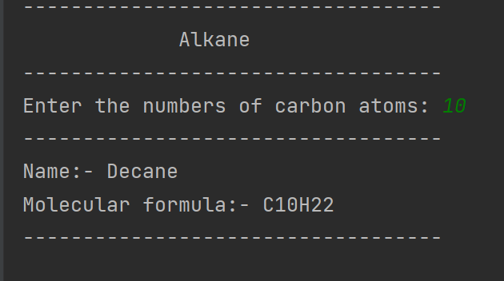

# Carbon compound:-Alkanes

Alkanes are organic compounds that consist of single-bonded carbon and hydrogen atoms. The formula for Alkanes is CnH2n+2, subdivided into three groups – chain alkanes, cycloalkanes, and the branched alkanes.

## Homologous alkanes

1.[Methane](en.wikipedia.org/wiki/Methane)

program output:

2.[Ethane](en.wikipedia.org/wiki/Ethane)

program output:

3.[Propane](en.wikipedia.org/wiki/Propane)

program output:

4.[Butane](en.wikipedia.org/wiki/Butane)

program output:

5.[Pentane](en.wikipedia.org/wiki/Pentane)

program output:

6.[Hexane](en.wikipedia.org/wiki/Hexane)

program output:

7.[Heptane](en.wikipedia.org/wiki/Heptane)

program output:

8.[Octane](en.wikipedia.org/wiki/Octanes)

program output:

9.[Nonane](en.wikipedia.org/wiki/Nonane)

program output:

10.[Decane](en.wikipedia.org/wiki/Decane)

program output:

